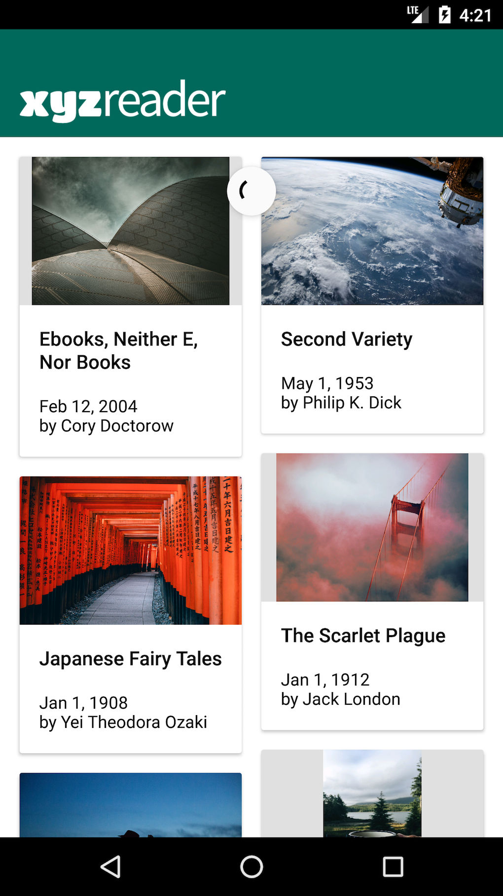
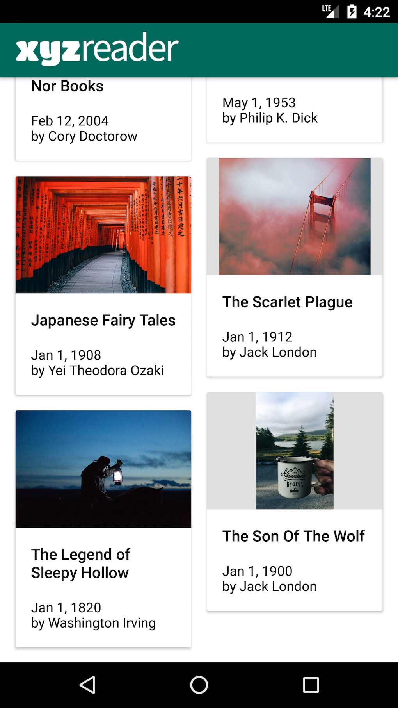
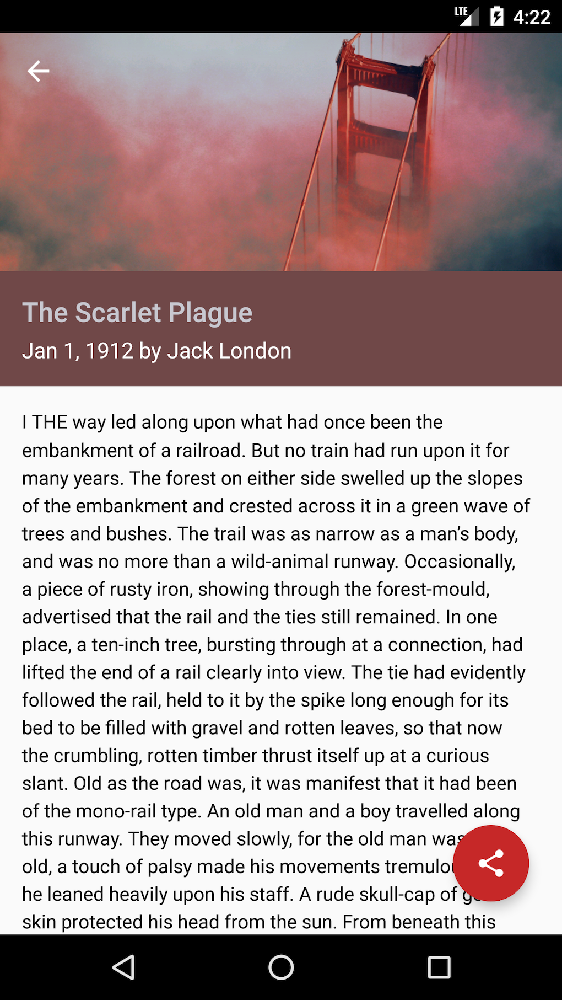
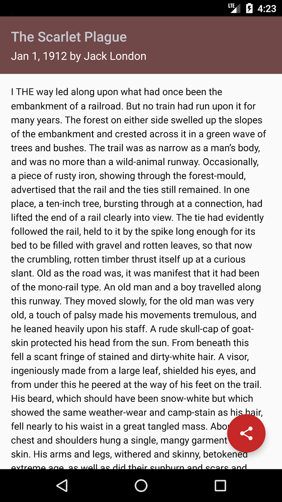
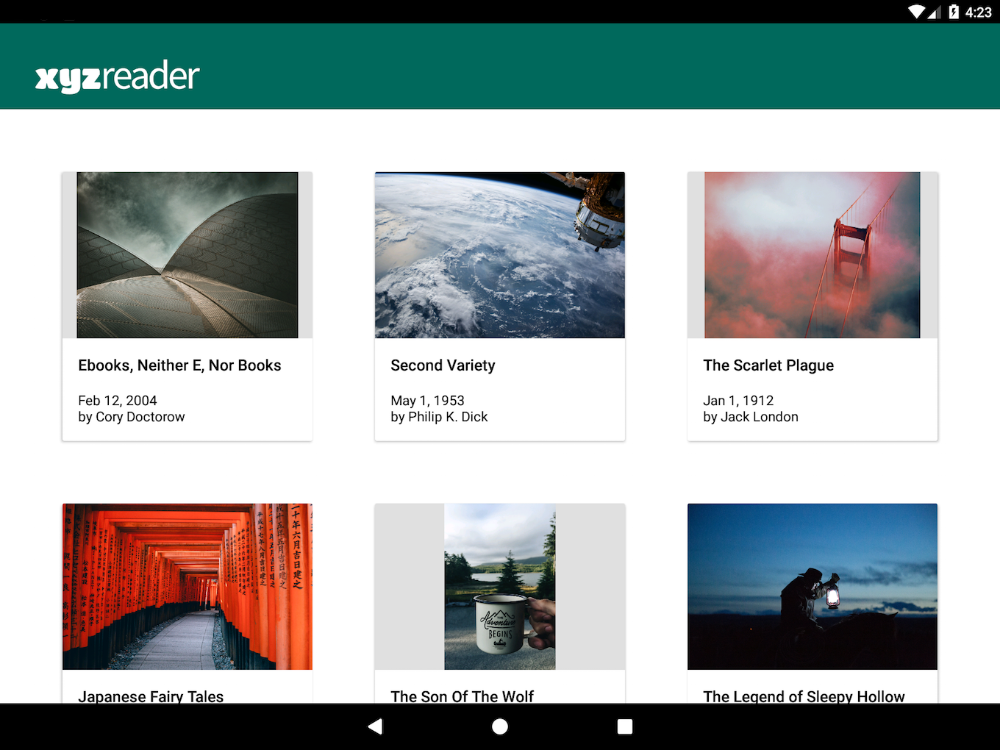
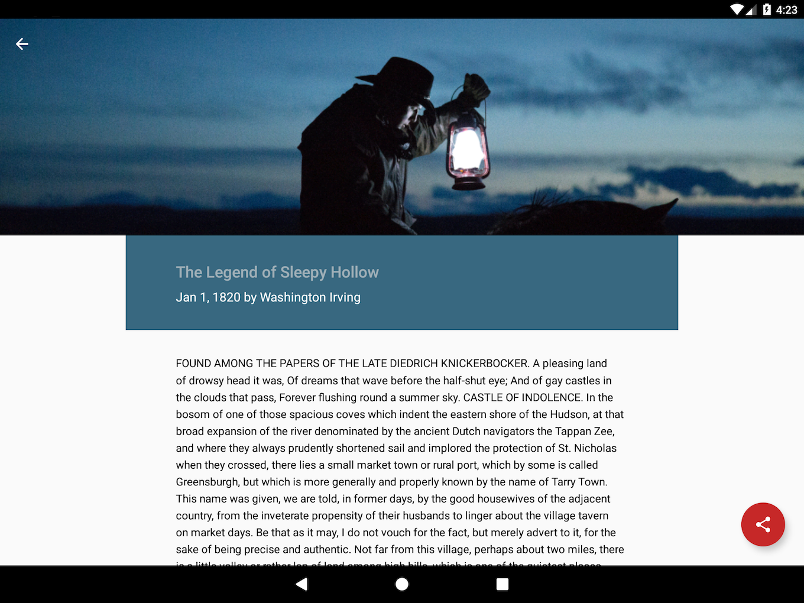
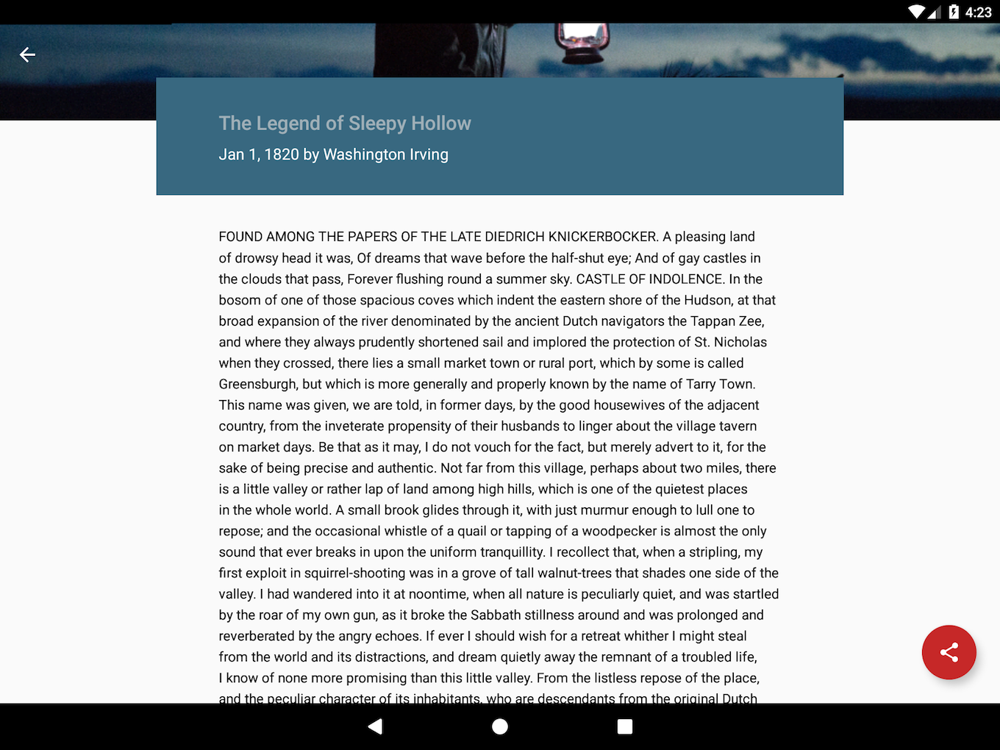

# XYZ Reader 
*Make Your App Material* Project for Udacity's Android Nanodegree Course.

To improve an existing app to confirm to Material Design.

*MainActivity Mobile*

  

*DetailActivity Mobile*

  

*MainActivity Tablet*

    
*DetailActivity Tablet*

  

